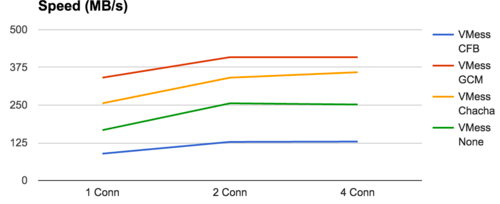
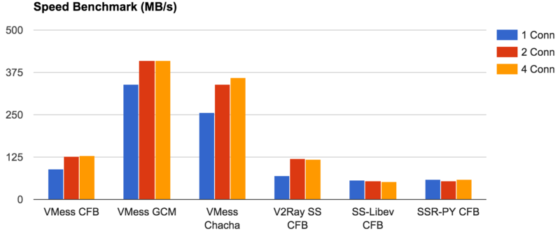

# 传说中的性能测试

一直都有人问 V2Ray 的性能问题，一直都很无奈因为没有人测过。被问得烦了，现在给一个比较科学，比较准确的结论。

## 本次测试的目的

测试 VMess 和 Shadowsocks 各种加密方式，在传输过程中的极限速度。

## 测试方法

在同一台主机上同时启动 V2Ray 客户端和服务器端，使用环回网络（Loopback）进行网络传输。客户端会接受到预设数量的数据，然后验证服务器端发出同样数量的数据。

### 测试环境

一台云主机，内存 2GB，CPU 信息如下。显然这台机器本身的性能不怎么样，如果用一台更好的机器，会得到更好的绝对数值，但本次实验结果的数值比例有参考价值。

```text
Architecture:          x86_64
CPU op-mode(s):        32-bit, 64-bit
Byte Order:            Little Endian
CPU(s):                2
On-line CPU(s) list:   0,1
Thread(s) per core:    1
Core(s) per socket:    2
Socket(s):             1
NUMA node(s):          1
Vendor ID:             GenuineIntel
CPU family:            6
Model:                 61
Model name:            Virtual CPU a7769a6388d5
Stepping:              2
CPU MHz:               2399.996
BogoMIPS:              4799.99
Hypervisor vendor:     KVM
Virtualization type:   full
L1d cache:             32K
L1i cache:             32K
L2 cache:              4096K
NUMA node0 CPU(s):     0,1
```

### 测试工具

特地写了两个小工具：loadgen 和 receiver。

loadgen 用于发送数据，它可以对某个端口建立连接，支持直连和 Socks 协议。可配置并发一定数量的连接，发送指定数量的数据后，验证 receiver 的反馈。如果 receiver 收到了同样数量的数据，则表明传输结束。

receiver 用于接收数据，对于每个连接，每次收到数据后，把总共收到的数据字节数发回，并等待连接发起方关闭连接。

由于 VMess 的正确性已被其它的测试验证，这里只需要验证连接畅通，即收到数据量等于发出数据量即可。

### 基本信息

我们用 loadgen 和 receiver 直接对接，可以得出环回网络的大致性能。实验结果如下：

数据量：50 GB / 连接

并发连接数   | 1 | 2 | 4
-----------|---|---|----
速度（MB/s）|4266|4654|4551

对比下面实验中的速度，可以认为环回网络的基本速度不会成为瓶颈。

进一步的基础信息，我们又测了一下使用 V2Ray 直连的速度。实验中只启动一个 V2Ray 进程，配置 Dokodemo-door <-> Freedom。实验结果如下：

数据量：10 GB / 连接

并发连接数   | 1 | 2 | 4
-----------|---|---|----
速度（MB/s）|640|819|787

### VMess 测试

测试场景的差别是 VMess 的加密方式，其它都一样。传入依然是 Dokodemo-door，传出是 Freedom。

* VMess CFB: AES-128-CFB 加密方式
* VMess GCM: AES-128-GCM 加密方式
* VMess Chacha: Chacha20-poly1305 加密方式
* VMess None: 不加密

结果如下（数据量：10 GB / 连接）：



解读如下：

* 速度 GCM > Chacha > None > CFB；
* VMess 可以同时处理多个连接。由于 CPU 是双核，所以 2 个连接的速度比单个连接快，而 4 个连接对比 2 个连接则没有明显提升；

很有趣的一点是 None 居然比 GCM 慢。不加密反而比加密慢，有一点违反常识。原因是这样的：VMess 不管加不加密，都会进行数据校验，None 中使用的校验算法是 FNV，而 GCM 是一个 AEAD 算法，自带校验。于是带 CPU 加成的校验比软件实现的校验快了不小。这一点也超出了开发人员的预期，之后会考虑提升校验的性能。

### 与 Shadowsocks 对比

V2Ray 和 Shadowsocks 的比较也是一个常见问题。既然我们有了一个性能测试的工具，那就一起测一下吧。

* V2Ray SS CFB: V2Ray 中的 Shadowsocks 实现，AES-128-CFB 加密方式；
* SS-Libev CFB: Shadowsocks libev 2.5.6，AES-128-CFB 加密方式，客户端 ss-tunnel，服务器端 ss-server；
* SSR-PY CFB: ShadowsocksR 最新的代码（2017-01-20），AES-128-CFB 加密方式。其它的参数都是默认的：auth\_aes128\_md5、tls1.2\_ticket\_auth\_compatible。

OTA 在所有 Shadowsocks 中都启用了。

实验结果（数据量：10 GB / 连接）：



解读如下：

* VMess 的速度优于 Shadowsocks；
* 比起 ss-libev 和 ssr-python，V2Ray 在多并发连接的场景中更有优势；

## 结论

* 在一台双核 2.4 GHz 的主机上，V2Ray 的极限传输速度超过 400 MB/s。
* 如果你对速度有需求，请使用 VMess + AES-128-GCM。

## 后记

* 在日常使用中，传输速度一般都不会超过 10 MB/s，上述测试的每种方式都可以满足需求。但如果你需要高性能传输，可以按测试结果选择合适的方式。
* 上述的测试结果都是运行多次的平均值。由于虚拟机的不稳定性，误差在 5% 以下。
* 其它方面的测试，如 CPU 和内存占用，会在后续的测试中进行。
* loadgen 和 receiver 可以由 iPerf 替代，唯一的问题是 iPerf 不支持 Socks 协议。
* 上述所有工具和测试脚本的源代码可以[在这里找到](https://github.com/v2ray/experiments/tree/master/benchmark)。
