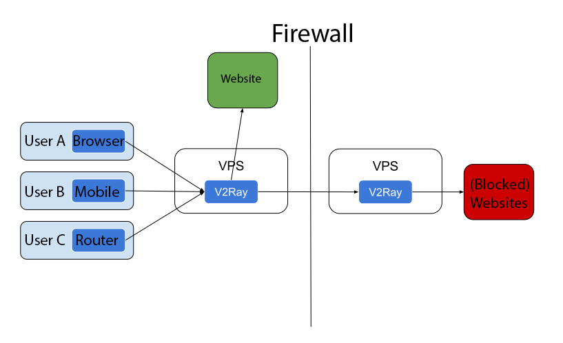

* * *

refcn: chapter_00/workflow refen: welcome/workflow

* * *

# Arbeitsablauf

## Einzelner Server

Wie bei anderen Proxys benötigen Sie einen Proxy-Server, auf dem V2Ray ausgeführt wird. Dann können Sie über diesen Server von Ihrem PC, Mobiltelefon oder anderen Geräten aus mit dem Internet verbinden.

V2Ray unterstützt Verbindungen von mehreren Geräten gleichzeitig mit optional unterschiedlichen Protokollen. In der Zwischenzeit kann der lokale Routing-Mechanismus nur die notwendigen Verbindungen intelligent herstellen.

## Serverbrücke

Wenn Sie nicht möchten, dass V2Ray auf jedem Ihrer Geräte konfiguriert wird, können Sie einen Server innerhalb der Firewall einrichten, und dann wird der gesamte Datenverkehr über diesen Server geleitet. Der Server führt das Routing selbst durch.

## Intern

Das interne von V2Ray sieht wie folgt aus. Es unterstützt mehrere eingehende Proxys und mehrere Outbounds. Jeder von ihnen ist unabhängig von anderen.

Anmerkungen:

* Sie müssen mindestens einen Eingang und einen Ausgang konfigurieren, damit V2Ray ordnungsgemäß funktioniert.
* Der eingehende Proxy kommuniziert mit einer Client-Software wie einem Browser.
* Der Outbound-Proxy kommuniziert mit dem Remote-Server, z. B. Apache, für eine Website.
* Der Dispatcher ist verantwortlich für die Auswahl eines Ausgangs für eine bestimmte Verbindung basierend auf konfigurierbaren Regeln.

Detaillierte Konfiguration kann hier gefunden werden [hier](../configuration/overview.md).