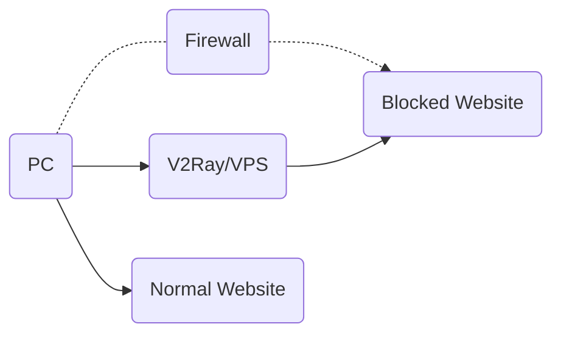
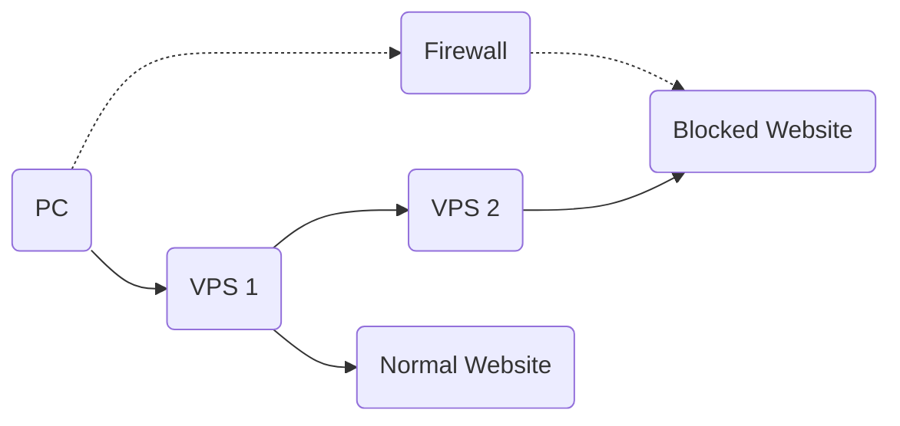
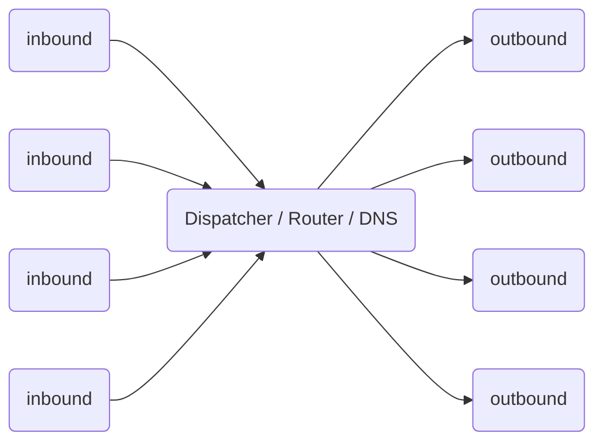

# گردش کار

## تنها سرور

همانند سایر پروکسی ها، شما نیاز به یک پروکسی سرور دارید که V2Ray را اجرا می کند. سپس شما می توانید از طریق آن سرور از طریق کامپیوتر، تلفن همراه یا سایر دستگاه های خود به اینترنت متصل شوید.

V2Ray supports connections from multiple devices at the same time, with optionally different protocols. In the mean time, the local routing mechanism can smartly proxy necessary connections only.

## پل سرور

In the case you don't want configuration V2Ray on each of your devices, you may setup a server within the firewall, and then all traffic go through that server. The server does routing itself.

## داخلی

The internal of V2Ray looks like below. It supports multiple inbound proxies, and multiple outbounds. Each of them are independent from others.

Notes:

* شما باید حداقل یک ورودی و یک خروجی را پیکربندی کنید تا V2Ray به درستی کار کند.
* پروکسی ورودی با نرم افزار کلاینت مانند مرورگر ارتباط برقرار می کند.
* پروکسی خروجی ارتباط با سرور از راه دور، مانند آپاچی برای وب سایت.
* توزیع کننده مسئول انتخاب یک خروجی برای یک اتصال داده شده بر اساس قوانین قابل تنظیم است.

Detailed configuration can be found [here](../configuration/overview.md).