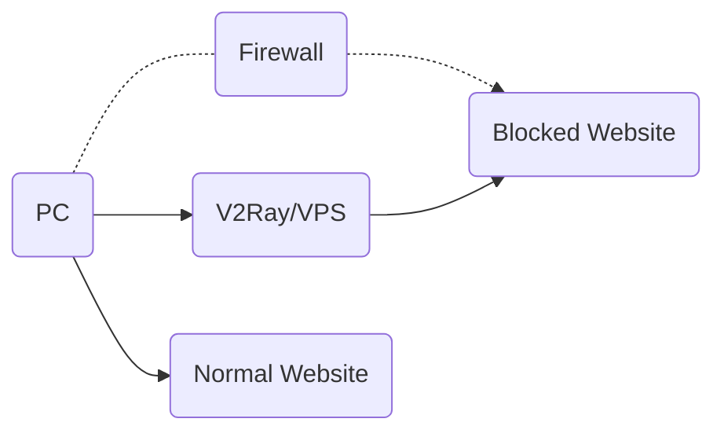
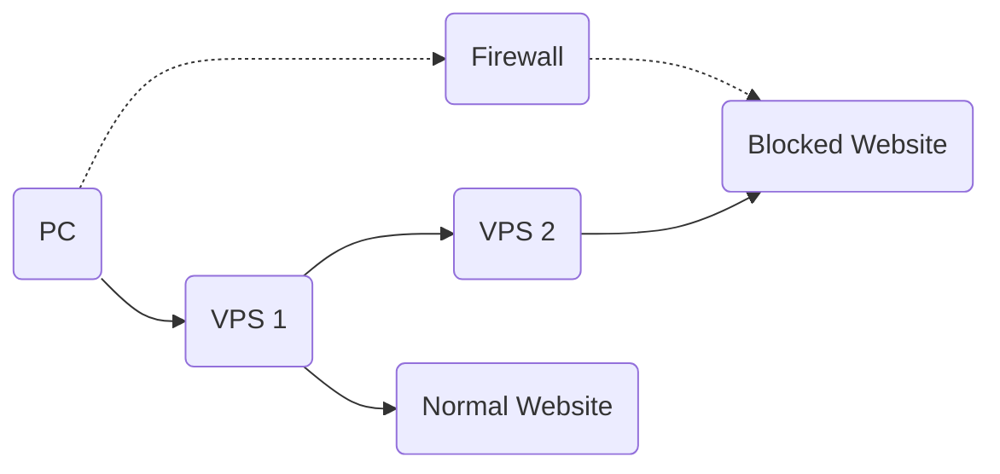
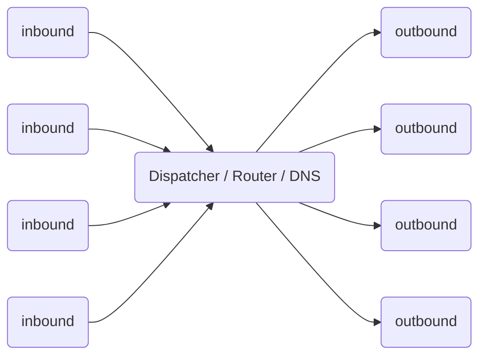

# 워크 플로

## 단일 서버

다른 프록시와 마찬가지로 V2Ray를 실행하는 프록시 서버가 필요합니다. 그런 다음 PC, 모바일 또는 기타 장치에서 해당 서버를 통해 인터넷에 연결할 수 있습니다.

V2Ray supports connections from multiple devices at the same time, with optionally different protocols. In the mean time, the local routing mechanism can smartly proxy necessary connections only.

## 서버 브리지

In the case you don't want configuration V2Ray on each of your devices, you may setup a server within the firewall, and then all traffic go through that server. The server does routing itself.

## 내부의

The internal of V2Ray looks like below. It supports multiple inbound proxies, and multiple outbounds. Each of them are independent from others.

Notes:

* V2Ray를 제대로 작동 시키려면 적어도 하나의 인바운드 및 하나의 아웃 바운드를 구성해야합니다.
* 인바운드 프록시는 브라우저와 같은 클라이언트 소프트웨어와 통신합니다.
* 아웃 바운드 프록시는 웹 사이트의 Apache와 같은 원격 서버와 통신합니다.
* 디스패처는 구성 가능한 규칙을 기반으로 특정 연결에 대한 아웃 바운드를 선택합니다.

Detailed configuration can be found [here](../configuration/overview.md).