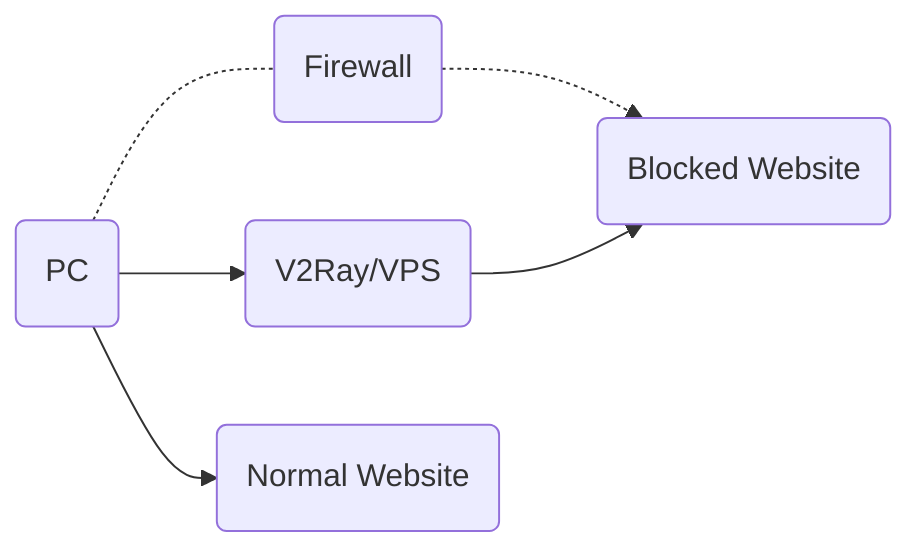
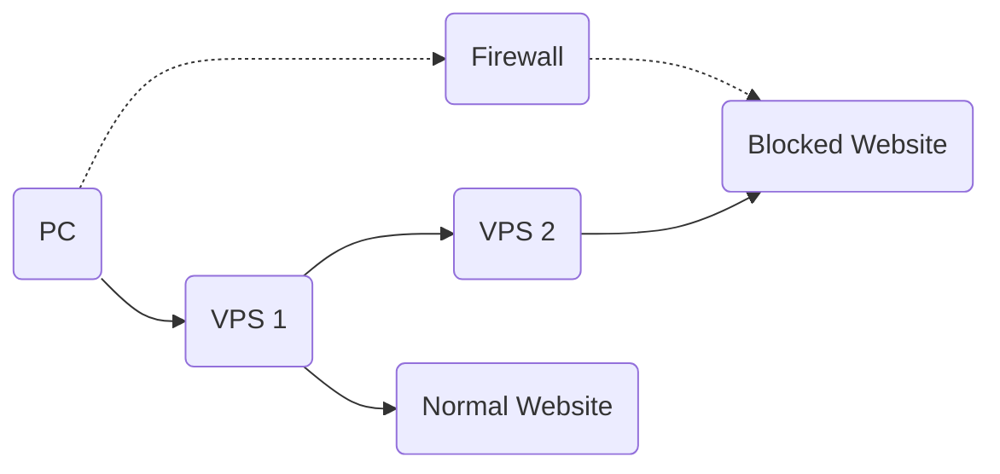
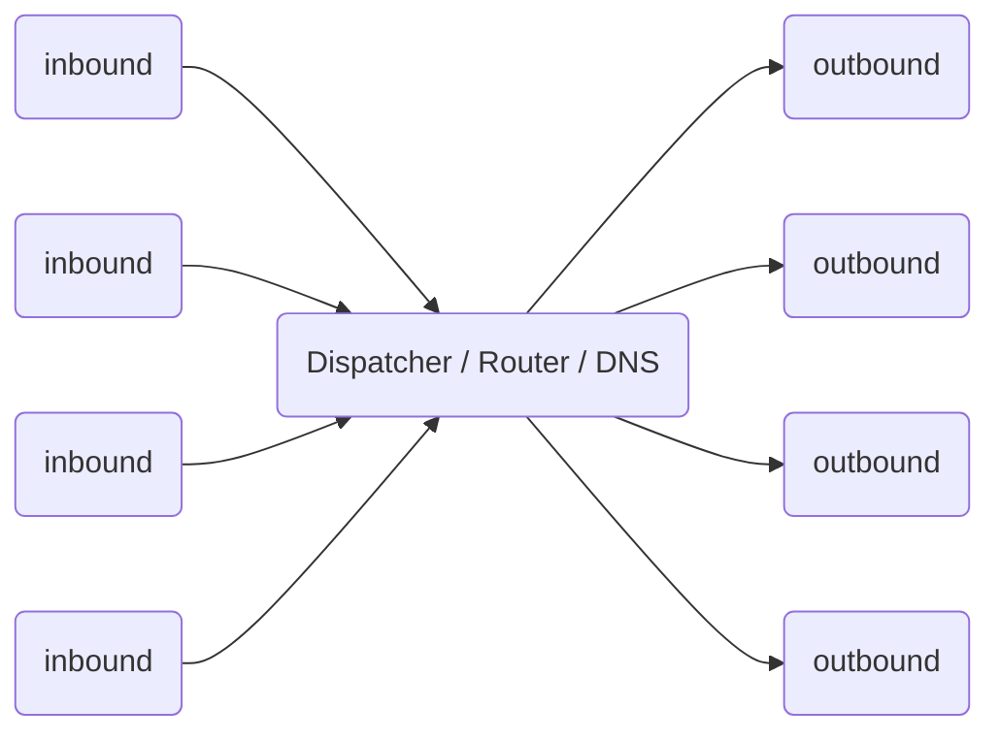

# Принцип работы

## Одиночный сервер

Как и в случае с другими прокси, вам нужен прокси-сервер, с запущенным V2Ray. Вы можете подключаться к Интернету через этот сервер с ПК, мобильных и других устройств.

V2Ray supports connections from multiple devices at the same time, with optionally different protocols. In the mean time, the local routing mechanism can smartly proxy necessary connections only.

## Мост из серверов

In the case you don't want configuration V2Ray on each of your devices, you may setup a server within the firewall, and then all traffic go through that server. The server does routing itself.

## Внутреннее устройство

The internal of V2Ray looks like below. It supports multiple inbound proxies, and multiple outbounds. Each of them are independent from others.

Notes:

* Вы должны настроить как минимум одно входящее и одно исходящее соединение, чтобы заставить V2Ray работать.
* Прокси на входе взаимодействует с клиентским программным обеспечением, например, браузером.
* Прокси на выходе взаимодействует с удаленным сервером, например Apache, на котором крутится сайт.
* Диспетчер выбирает исходящее соединение для запроса на основе настраиваемых правил.

Detailed configuration can be found [here](../configuration/overview.md).