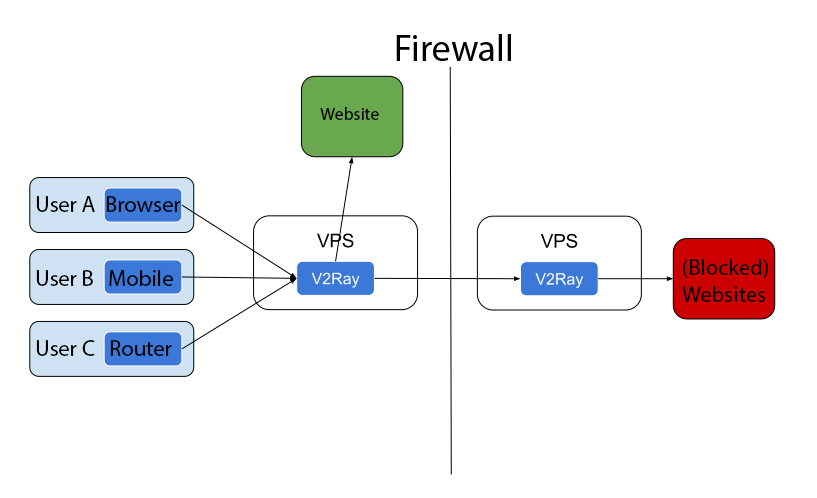

# Принцип работы

 

## Одиночный сервер

Как и в случае с другими прокси, вам нужен прокси-сервер, с запущенным V2Ray. Вы можете подключаться к Интернету через этот сервер с ПК, мобильных и других устройств.

V2Ray поддерживает соединения с нескольких устройств с различными протоколами одновременно. В то же время механизм локальной маршрутизации может грамотно проксировать только необходимые соединения.

## Мост из серверов

Если вам не хочется настраивать V2Ray на каждом устройстве, вы можете настроить сервер до файрвола, весь трафик будет проходить через этот сервер. Сервер сам будет маршрутизировать соединения.

## Внутренности

The internal of V2Ray looks like below. It supports multiple inbound proxies, and multiple outbounds. Each of them are independent from others.

Notes:

* You have to configure at least one inbound and one outbound to make V2Ray work properly.
* The inbound proxy communicates with client software such as browser.
* The outbound proxy communicates with remote server, such as Apache for a website.
* The dispatcher is responsible for choosing a outbound for a given connection, based on configurable rules.

Detailed configuration can be found [here](../configuration/overview.md).