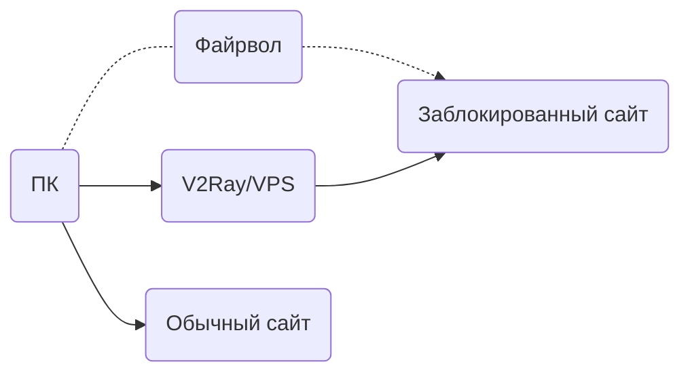
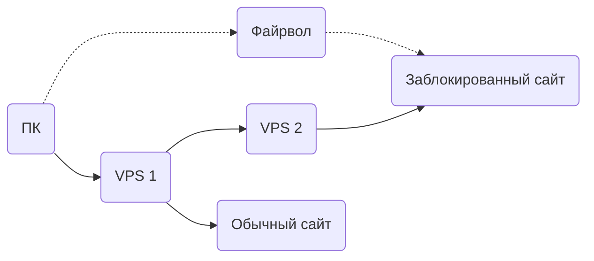
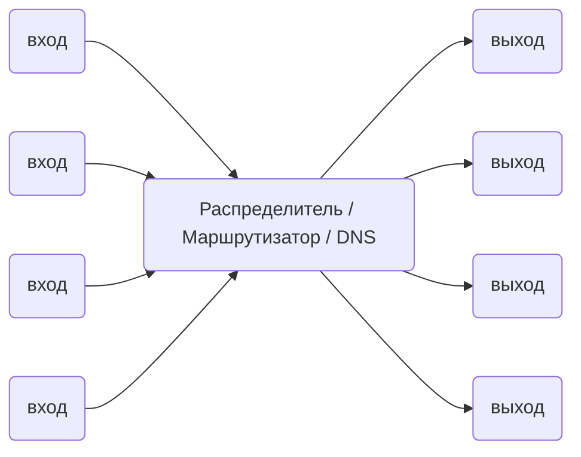

# Принцип работы

## Одиночный сервер

Как и в случае с другими прокси, вам нужен прокси-сервер, с запущенным V2Ray. Вы можете подключаться к Интернету через этот сервер с ПК, мобильных и других устройств.

V2Ray поддерживает соединения с нескольких устройств с различными протоколами одновременно. В то же время механизм локальной маршрутизации может грамотно проксировать только необходимые соединения.

## Мост из серверов

Если вам не хочется настраивать V2Ray на каждом устройстве, вы можете настроить сервер до файрвола, весь трафик будет проходить через этот сервер. Сервер сам будет маршрутизировать соединения.

## Внутреннее устройство

Изнутри V2Ray выглядит как показано ниже. Он поддерживает несколько входящих прокси-соединений и несколько исходящих. Каждое из них независимо от других.

Замечания:

* Вы должны настроить как минимум одно входящее и одно исходящее соединение, чтобы заставить V2Ray работать.
* Прокси на входе взаимодействует с клиентским программным обеспечением, например, браузером.
* Прокси на выходе взаимодействует с удаленным сервером, например Apache, на котором крутится сайт.
* Диспетчер выбирает исходящее соединение для запроса на основе настраиваемых правил.

Детально настройки рассматриваются [здесь](../configuration/overview.md).