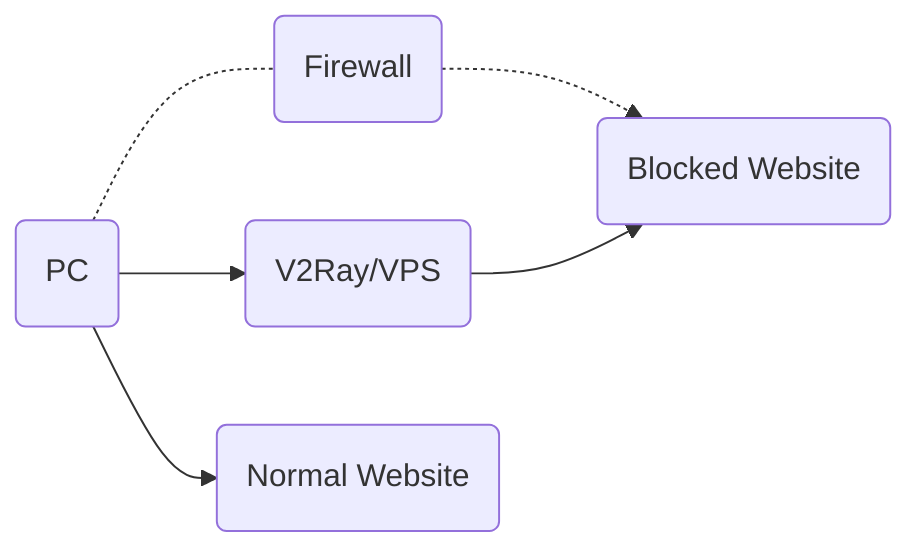
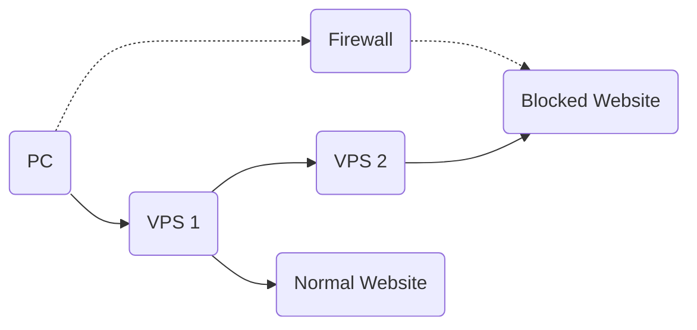
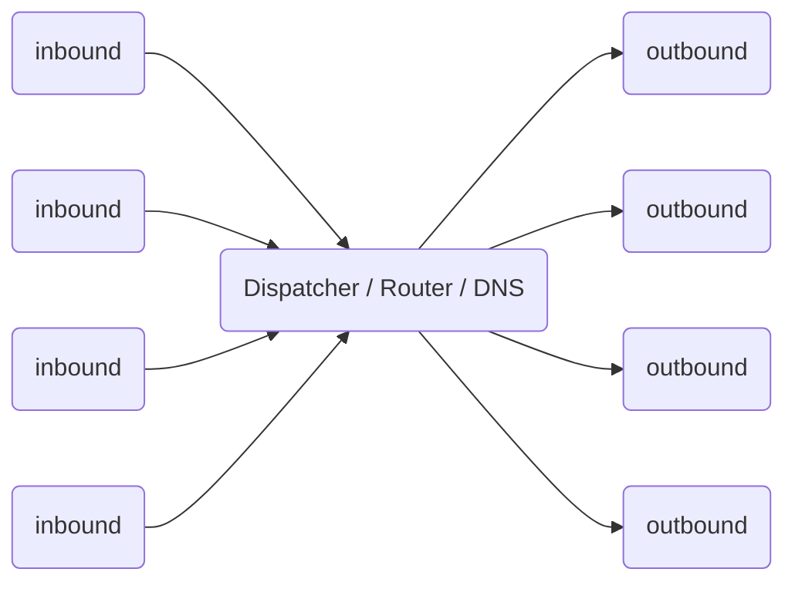

# Quy trình làm việc

## Máy chủ đơn

Giống như các proxy khác, bạn cần một máy chủ proxy chạy V2Ray. Sau đó, bạn có thể kết nối với internet thông qua máy chủ đó từ máy tính, thiết bị di động hoặc các thiết bị khác.

V2Ray supports connections from multiple devices at the same time, with optionally different protocols. In the mean time, the local routing mechanism can smartly proxy necessary connections only.

## Server Bridge

In the case you don't want configuration V2Ray on each of your devices, you may setup a server within the firewall, and then all traffic go through that server. The server does routing itself.

## Nội bộ

The internal of V2Ray looks like below. It supports multiple inbound proxies, and multiple outbounds. Each of them are independent from others.

Notes:

* Bạn phải định cấu hình ít nhất một lượt vào và ra ngoài để làm cho V2Ray hoạt động chính xác.
* Proxy gửi đến giao tiếp với phần mềm ứng dụng khách như trình duyệt.
* Proxy đi giao tiếp với máy chủ từ xa, chẳng hạn như Apache cho một trang web.
* Điều phối viên chịu trách nhiệm chọn một đường đi cho một kết nối nhất định, dựa trên các quy tắc có thể cấu hình được.

Detailed configuration can be found [here](../configuration/overview.md).