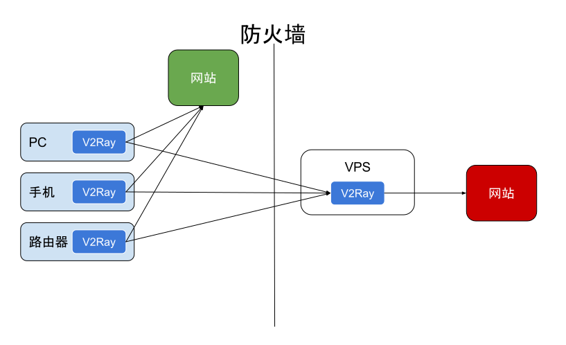
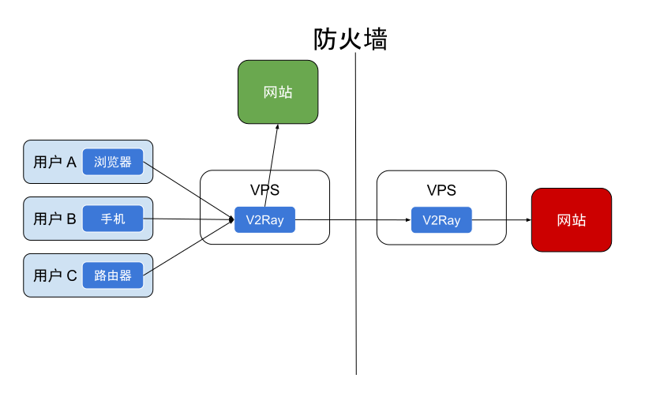

# 工作机制

## 单服务器模式 {#single}

和其它的网络代理工具一样，你需要在一台配置了 V2Ray 的服务器，然后在自己的设备上安装 V2Ray 客户端，然后即可流畅地访问互联网。

一个 V2Ray 服务器可同时支持多台设备，使用不同的代理协议访问。同时，经过合理的配置，V2Ray 可以识别并区分需要代理和不需要代理的流量，直连的流量不需要绕路。

## 桥接模式 {#bridge}

如果你不想在每一台设备上都配置路由，你也可以设置一台中转服务器，用于接收客户端发来的所有流量，然后在服务器中进行转发判断。

## 工作原理 {#internals}

在配置 V2Ray 之前，不妨先来看一下 V2Ray 的工作原理，以下是单个 V2Ray 进程的内部结构示意图。多个 V2Ray 之间互相独立，互不影响。

* 需要配置至少一个传入协议（Inbound）和一个传出协议（Outbound）才可以正常工作。[协议列表](../chapter_02/02_protocols.md)见第二章节。
  * 传入协议负责与客户端（如浏览器）通信：
    * 传入协议通常可以配置用户认证，如 ID 和密码等；
    * 传入协议收到数据之后，会交给分发器（Dispatcher）进行分发；
  * 传出协议负责将数据发给服务器，如另一台主机上的 V2Ray。
* 当有多个传出协议时，可以配置路由（Routing）来指定某一类流量由某一个传出协议发出。
  * 路由会在必要时查询 DNS 以获取更多信息来进行判断。

具体的配置格式详见[第二章节](../chapter_02/01_overview.md)。
