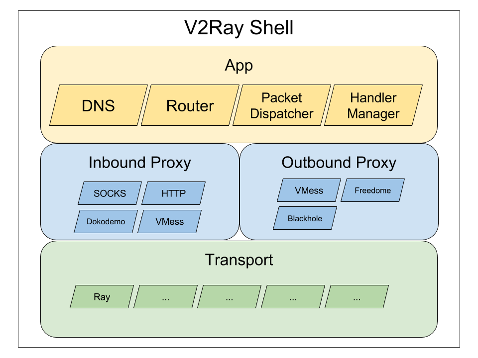

# 核心设计

本文描述了 V2Ray 的核心部分（v2ray-core）的设计思路。

## 目标
* v2ray-core 提供了一个网络代理平台，它是一个可以运行的最小功能集合，在其之上可以进二次开发，以提供更好的用户体验；
* v2ray-core 以跨平台为首要原则，以减少二次开发的成本；

## 架构

v2ray-core 内部分为三层：应用层、代理层和传输层。每一层内包含数个模块，模块间互相独立，同类型的模块可以无缝替换。v2ray-core 外部使用一个壳（Shell）包裹，用于和操作系统交互，如解析命令行参数、设置日志信息等。

## 应用层
应用层包含一些代理层中常用的功能，这些功能被抽象出来，以便在不同的代理模块中复用。应用层的模块应为纯软件实现，不与硬件或平台相关的技术有关。

重要模式列表：
* Packet Dispatcher: 用于把传入代理所接收到的数据，传送给传出代理；
* Router: 内置路由，详见[[路由配置]]；
* DNS: 内置的 DNS 缓存；
* Inbound Handler Manager: 传入代理的管理器；

## 代理层
代理层分为两部分：传入代理（Inbound Proxy）和传出代理（Outbound Proxy）。两部分相互独立，传入代理不依赖于某个特定的传出代理，反之亦然。所有已实现的[协议列表](../chapter_02/02_protocols.md)一览。

### 传入代理
* 实现 [proxy.InboundConnectionHandler](https://github.com/v2ray/v2ray-core/blob/master/proxy/proxy.go#L11) 接口；
* 通过调用 [DispatchToOutbound](https://github.com/v2ray/v2ray-core/blob/master/app/packet_dispatcher.go#L10) 方法将数据传输给传出代理；

### 传出代理
* 实现 [proxy.OutboundConnectionHandler](https://github.com/v2ray/v2ray-core/blob/master/proxy/proxy.go#L19) 接口；

## 传输层
传输层提供一些网络数据传输相关的工具模块。
